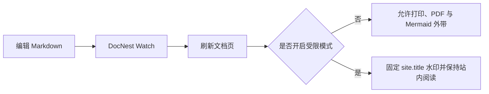

# 横向发布流程

下面的横向图模拟一次文档从编辑到交付的流程，也用于验证宽图的内联渲染。普通模式下可以打开大图并下载；受限模式下仍可阅读图表，但不会出现大图和下载入口。

## 观察重点

1. 页面内的图表会随文档一起渲染，不需要手工上传图片。
2. 打开大图后点击“重置”，应回到适合当前视口的默认缩放。
3. 在 `restrictedMode: true` 下，图表本身保留，但查看器和下载按钮消失。
