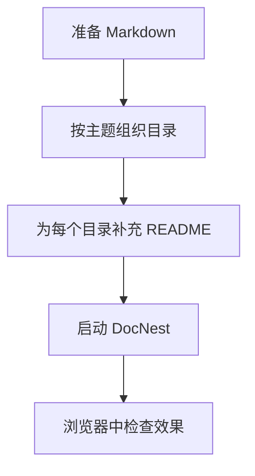

# 流程图语法

Mermaid 图表直接写在 Markdown 的 `mermaid` 代码块中，文档仍然是普通文本，便于版本管理和代码审查。

## 一个小例子

## 编写建议

- 给节点使用短标题，把解释放到正文中。
- 横向流程适合展示阶段和依赖关系，纵向流程适合展示步骤和决策。
- 图表旁边补充文字说明，避免读者只能依赖图形理解规则。
- 对可能很宽的图，优先在普通模式下用大图查看器检查起点、终点和滚动范围。

返回[图表示例](./README.md)。
