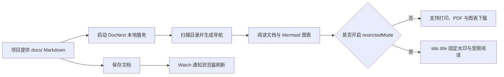

# DocNest 使用流程

下面的流程图把 DocNest 的核心使用路径串起来：宿主项目提供 Markdown，DocNest 负责本地服务、阅读体验和按策略提供导出能力。

## 这张图对应的能力

- 文档存储与文档中心解耦，项目可以继续使用自己的目录或存储适配器。
- 目录树、README 入口、章节导航和面包屑由 DocNest 自动生成。
- Mermaid、PDF、水印和受限阅读由统一策略控制。
- 默认只启动本地服务，不依赖远程发布平台。
